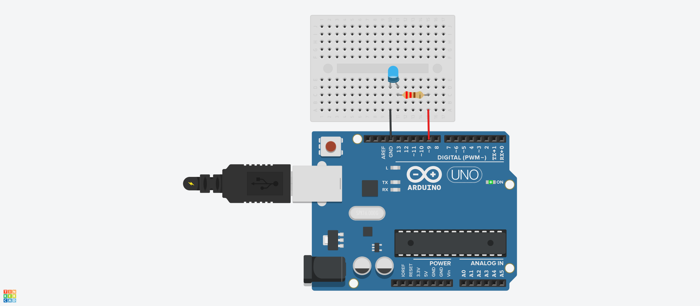

# Acendendo LED

Para visulizar ou até mesmo editar o arquivo do tinkecard basta [clicar aqui](https://www.tinkercad.com/things/gGQ0Lw6lyOG).

## Material usado

- Arduino Uno;
- LED (Cor de sua preferência);
- 2 Jumpers;
- 1 resistor de 150R(Mas se tiver um de 220R, dá certo);
   
## Entendendo o projeto

  Um LED necessita de 2V e consome uma corrente de 20mA,
  sendo assim como nossa alimentação é de 5V e 2 ficam no LED, alguém precisa segurar 3V na "mão" e esse é o papel de um resistor.

  Mas temos vários resistores e cada um tem sua força de resistência...
   Dai vem a pergunta _"qual devemos escolher?"_
  
  Como tudo na vida pode ser explicado matemáticamente, podemos descobrir realizando um simples calculo.

  - R: resistência, medida em Ohm (Ω);
  - U: diferença de potencial elétrico (ddp), medido em Volts (V);
  - I: intensidade da corrente elétrica, medida em Ampére (A).

  

  
	Resistor = Tensão do Resistor(V) / Corrente do Resistor
  	Resistor = 3V (Tensão sobre o resistor) / 0,02(Corrente do led = 20mA ou 0,02A)
  
  Tendo como resultado 150, então só precisariamos pegar o resistor de 150 e ligar em paralelo como foi feito no projeto.

  Como podem ver pelo padrão de cores, o resistor utilizado na imagem é de 220R, justamente porquê eu só tinha ele disponivel. O importante é não deixar passar mais do que necessario, pois iriamos queimar o dispositivo.